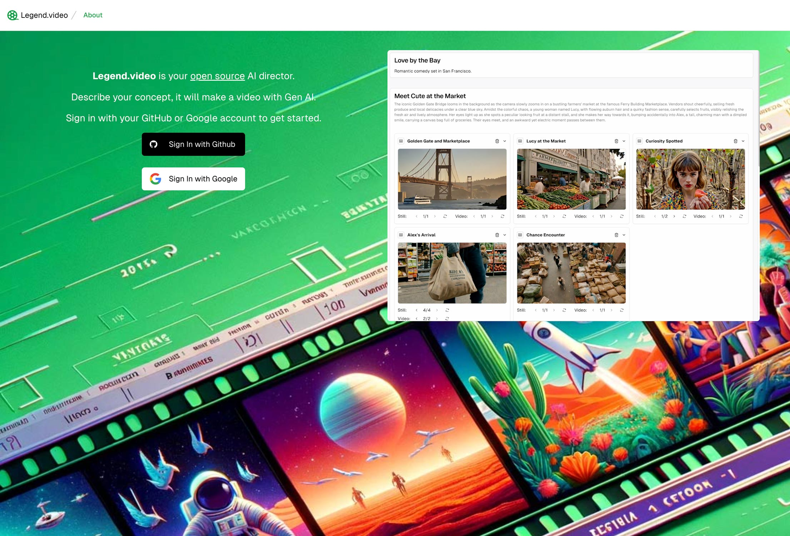
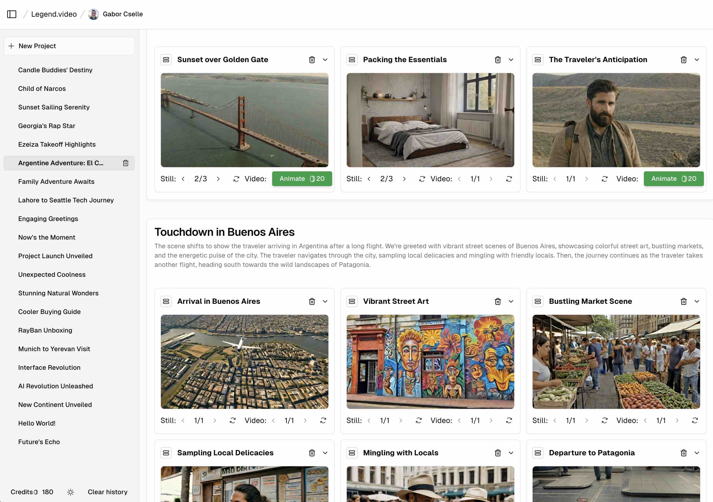

Legend.video lets you build generative AI video with a simple workflow. You can try it at [Legend.video](https://legend.video).

# Screenshots





# Features

From a simple prompt (e.g. &quot;San Franciso romcom&quot;), Legend.video will first generate a storyboard with scenes consisting of individual shots. You can then edit the storyboard, generate still images for each shot, and then generate a video from the still images. The output is a video that tells a story. 

Current video models generate 2-4 second clips which fail to tell a story. Legend.video helps you build a story from these short 2-4 second shots.

# Technology

* Next.js App Router, Tailwind CSS, shadcn/ui
* Supabase for OAuth (via Github and Google) and Postgres DB
* gpt-4-turbo-preview for generating storyboards (but this can be replaced with gpt-3.5-turbo and any model that supports function calling)
* text-to-image and image-to-video models on Replicate for generating still images and videos
* We're hosting https://legend.video/ on Vercel, but you could easily run it elsewhere too.
* We're using Stripe to charge users for additional generation credits after the initial 200 free credits every user receives.

# How to run

Copy the `.env.example` into a local `.env.local` file to set up the various environment variables and secrets: We're using Supabase for storage, Vercel for blob storage, Github and Google for login, and Replicate for AI generation.

```$ cp .env.example .env.local```

DB storage: You'll need to start a Supabase project and preload the DB schema from `docs/db_schema.sql`.

Vercel Blob storage: We're using Vercel blobstore. You can create a blob store on their free plan and fill in the `BLOB_READ_WRITE_TOKEN` variable.

Login: You can create a GitHub OAuth token in your settings. For Google, you'll need to start a new project and create OAuth keys.

Replicate: We're using Replicate for their hosted AI models. Sign up for a key [here](https://replicate.com/), and copy your token into `REPLICATE_API_TOKEN`.

Then run these commands to install and dependencies and start the server:

```
$ pnpm install
$ pnpm run dev
```

You should now be able to see the app running at [localhost:3000](http://localhost:3000).

# Where YOU can help

If you'd like help with any of the following, get in touch:

1. **Keeping styling consistent between shots** - we've made some progress with this, but it's not perfect
2. **Keeping characters consistent betweent shots** - we've experimentd with prompting methods for this, but we need a more sophisticated solution
3. **Sound** - we'd love help with adding sound to the videos
4. **Edit by prompting** - Allow users to edit their stories ChatGPT style.
5. **UI Refinements** - We'd love help with making the UI more intuitive and user-friendly
6. **New models** - If you have access to newer and better video models that you'd like to make accessible throgh Legend.video, let us know. We'd love to give it a try.

# Report Issues

Please report issues at the [Github Issues page](https://github.com/gaborcselle/legend.video/issues).

# Contributing

If you'd like to contribute bugfixes or new features, please fork the repo, make your changes in a branch, and then submit a pull request. We'll review it as soon as possible and merge it in if it's good.


