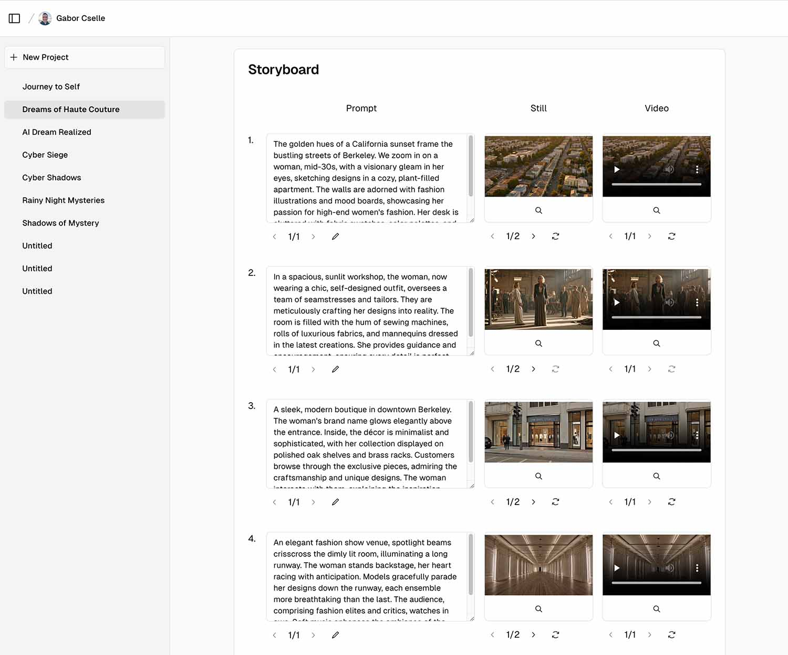

Legend.video lets you build generative AI video with a simple workflow. You can try it at [Legend.video](https://legend.video).

# Screenshot



# Features

From a simple prompt (e.g. &quot;San Franciso romcom&quot;), Legend.video will first generate a storyboard with scenes consisting of individual shots. You can then edit the storyboard, generate still images for each shot, and then generate a video from the still images. The output is a video that tells a story. 

Current video models generate 2-4 second clips which fail to tell a story. Legend.video helps you build a story from these short 2-4 second shots.

# Technology

* Next.js App Router, Tailwind CSS, shadcn/ui
* Supabase for OAuth (via Github and Google) and Postgres DB
* gpt-4-turbo-preview for generating storyboards (but this can be replaced with gpt-3.5-turbo and any model that supports function calling)
* text-to-image and image-to-video models on Replicate for generating still images and videos
* We're hosting https://legend.video/ on Vercel

# How to run


Edit the `.env` file to set up the various environment variables: Supabase for storage, Github and Google for login, and Replicate for AI generation.

Then run these commands to install and dependencies and start the server:

```
pnpm install
pnpm run dev
```
# Where we need help

We need help with the following:
1. **Keeping styling consistent between shots** - we've made some progress with this, but it's not perfect
2. **Keeping characters consistent betweent shots** - we've experimentd with prompting methods for this, but we need a more sophisticated solution
3. **Sound** - we'd love help with adding sound to the videos
4. **UI Refinements** - we'd love help with making the UI more intuitive and user-friendly

# Report Issues

Please report issues at the [Github Issues page](https://github.com/gaborcselle/legend.video/issues).

# Contributing

If you'd like to contribute bugfixes or new features, please fork the repo, make your changes in a branch, and then submit a pull request. We'll review it as soon as possible and merge it in if it's good.


